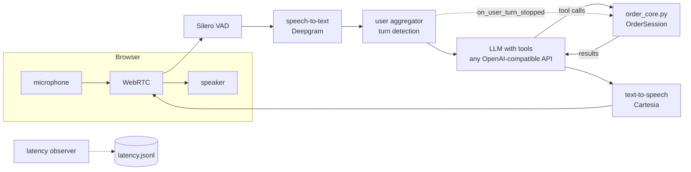
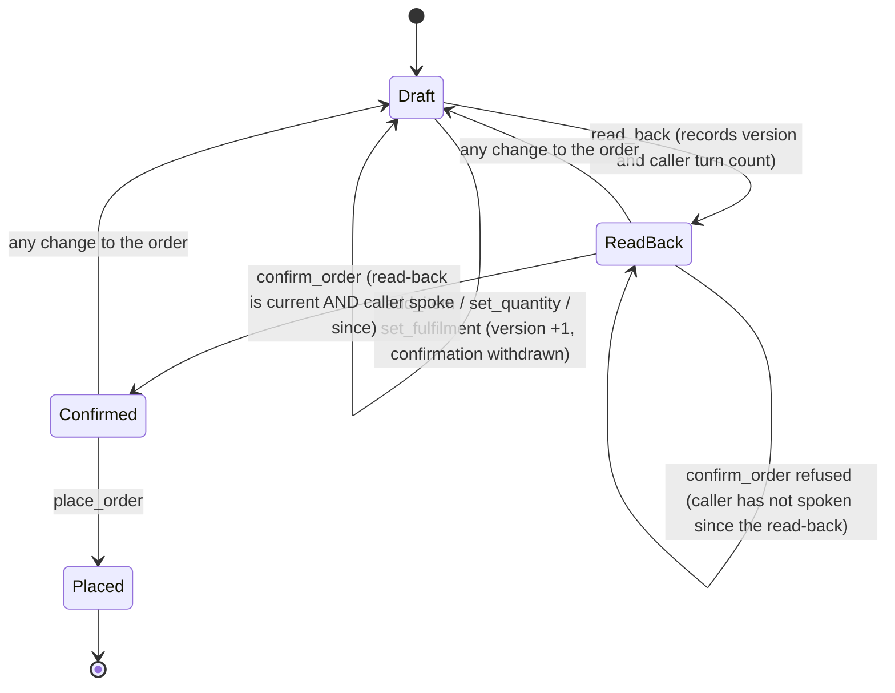

# Architecture

## Goal and the rule behind the design
A caller orders food, asks about the menu, books a table, or is handed to a person. Voice makes mistakes expensive to
notice (nobody sees a screen), so the system is built around one rule: **the model talks, code decides.**

| decided by code (`order_core.py`) | decided by the model |
|---|---|
| what is on the menu, prices, totals, delivery fee | how to phrase a reply, in short spoken sentences |
| valid quantities and sizes, opening hours, party size | which tool to call next |
| whether an order may be placed (confirmation gate) | how to ask for a missing detail |
| what the call summary says | when a request sounds like an allergy or a complaint (code then routes it) |

## Components

- **Transport:** Pipecat's WebRTC transport with its prebuilt browser client. No phone number is needed.
- **Speech-to-text, text-to-speech:** Deepgram and Cartesia by default; each is one constructor in `bot.py`.
- **LLM:** any OpenAI-compatible chat API with tool calling, configured by environment variables.
- **Core:** `OrderSession` holds the order, the confirmation state, reservations and transfers for one call.
- **Observer:** `UserBotLatencyObserver` writes the time from the end of the caller's speech to the first reply audio.

## The tools the model can call
`lookup_item`, `add_item`, `set_quantity`, `set_fulfilment`, `read_back`, `confirm_order`, `place_order`, `book_table`,
`transfer_to_human`. Each is a method on `OrderSession`; `bot.py` exposes them through one generic handler, and
`chat_sim.py` through another, both generated from the same `core.TOOLS` list, so the simulator and the voice bot share one set of tool definitions. Every tool returns
`{"ok": true, ...}` or `{"ok": false, "error": "..."}`; the error text is written so the model can relay it to the caller.

## The confirmation gate (the part that matters most)

Three conditions must all hold before `place_order` succeeds:
1. `read_back` was called after the most recent change (`read_back_version == version`).
2. The caller has spoken since that read-back (`customer_turns > read_back_turn`). The bot calls
   `note_customer_turn()` on every `on_user_turn_stopped` event, so the model cannot read back and confirm in one breath.
3. `confirm_order` was called and no change happened afterwards.

The model decides *whether the caller's words mean yes*; the code only guarantees that the caller had a chance to answer
the current read-back. That is a deliberate limit: a caller who says "uh-huh" while talking to someone else can still be
read as a yes by the model. Mitigation, not elimination.

## Other deterministic rules
- Pizzas need a size; quantities are integers from 1 to 20; unknown item ids list the menu.
- Delivery needs an address and a food subtotal of at least the configured minimum; the delivery fee is added by code.
- Reservations must fall inside opening hours (last table one hour before close), party size 1 to 8, with a name.
- Allergy and health questions: `lookup_item` returns the listed allergens and a fixed note that staff must confirm; the
  prompt requires a transfer to a person.
- The call summary (`summary()`) is built from state, never from model text.

## Where things live
| file | role |
|---|---|
| `order_core.py` | session state, tools, prompt text |
| `menu.json` | fictional menu, hours, fees |
| `bot.py` | Pipecat pipeline and providers |
| `chat_sim.py` | text simulator with scripted callers |
| `test_core.py`, `test_pipeline.py`, `test_tools.py` | tests, see `TESTING.md` |
| `tools/latency_report.py` | summarises `latency.jsonl` |
| `tools/make_sample_calls.py` | renders `runs/` into `docs/examples/sample_calls.md` |

## Choices worth knowing about
- **Why not a speech-to-speech model?** A cascaded pipeline (STT, LLM, TTS) lets each part be swapped, logged and measured,
  and keeps tool calling and the deterministic core in plain text. The cost is latency; see `TESTING.md` for how to measure it.
- **Why the system prompt lives on the LLM service**, not in the context: current Pipecat deprecates a leading system
  message in the context.
- **State is per call and in memory.** Nothing is stored between calls except the summary line in `calls.jsonl`.
