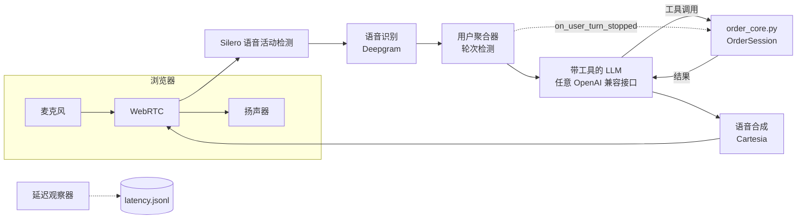
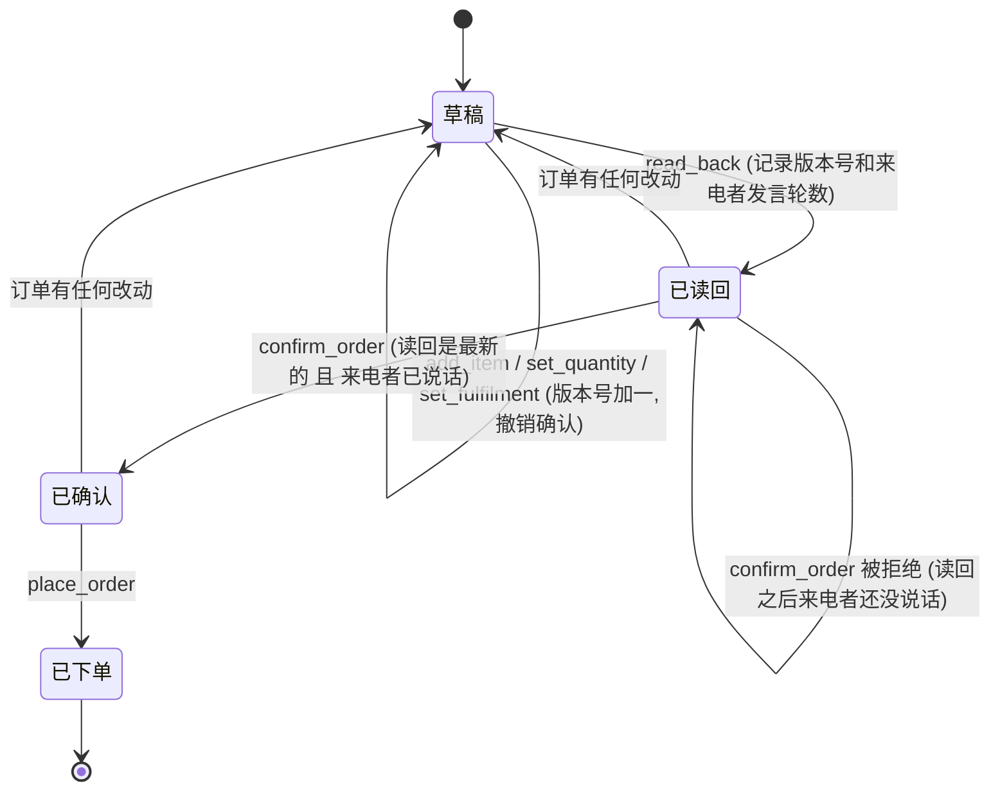

[English](../ARCHITECTURE.md) | **简体中文**

# 架构

## 目标与设计原则
来电者点餐、询问菜单、预订座位,或被转给真人。语音场景里错误很难被察觉(没人看着屏幕),所以整个系统围绕一条原则构建:**模型说话,代码决定。**

| 由代码决定(`order_core.py`) | 由模型决定 |
|---|---|
| 菜单上有什么、价格、总价、配送费 | 怎么措辞回复,用简短的口语句子 |
| 合法的数量和尺寸、营业时间、人数 | 下一步调用哪个工具 |
| 订单能否下单(确认闸门) | 缺少信息时怎么追问 |
| 通话摘要写什么 | 一个请求听起来是不是过敏或投诉(之后由代码负责转接) |

## 组件

- **传输:** Pipecat 的 WebRTC 传输,配自带的浏览器客户端。不需要电话号码。
- **语音识别、语音合成:** 默认 Deepgram 和 Cartesia;在 `bot.py` 里各是一行构造函数。`speech_sse_tts.py` 额外提供一个语音合成适配器,适用于带 OpenAI 风格 `/audio/speech` 接口、并以服务器推送事件流式返回的服务(由 `TTS_BASE_URL` 选择)。
- **LLM:** 任意支持工具调用的 OpenAI 兼容聊天接口,通过环境变量配置。
- **核心:** `OrderSession` 保存一通电话的订单、确认状态、预订和转接。
- **观察器:** `UserBotLatencyObserver` 记录从来电者说完到回复的第一段音频之间的时间。

## 模型可以调用的工具
`lookup_item`、`add_item`、`set_quantity`、`set_fulfilment`、`read_back`、`confirm_order`、`place_order`、`book_table`、`transfer_to_human`。每个都是 `OrderSession` 上的方法;`bot.py` 用一个通用处理函数把它们暴露出去,`chat_sim.py` 用另一个,两者都由同一份 `core.TOOLS` 列表生成,所以模拟器和语音 bot 共用同一套工具定义。每个工具返回 `{"ok": true, ...}` 或 `{"ok": false, "error": "..."}`;错误文字是写给模型看的,方便它转述给来电者。

## 确认闸门(最重要的部分)

`place_order` 成功必须同时满足三个条件:
1. 最近一次改动之后调用过 `read_back`(`read_back_version == version`)。
2. 来电者在该次读回之后说过话(`customer_turns > read_back_turn`)。bot 在每个 `on_user_turn_stopped` 事件里调用 `note_customer_turn()`,所以模型无法一口气读回并确认。
3. 调用过 `confirm_order`,且之后没有任何改动。

*来电者的话是不是"同意"*由模型判断;代码只保证来电者有机会回答当前这一次读回。这是有意保留的局限:来电者一边跟别人说话一边随口"嗯嗯",仍可能被模型当成同意。这是缓解,不是根除。

## 其他确定性规则
- 披萨必须选尺寸;数量是 1 到 20 的整数;不认识的菜品编号会列出菜单。
- 配送需要地址,且食品小计不低于设定的最低金额;配送费由代码加上。
- 预订必须在营业时间内(最后一桌在打烊前一小时),人数 1 到 8,并要有姓名。
- 过敏和健康问题:`lookup_item` 返回列出的过敏原和一条固定提示(须由店员确认);提示词要求转接真人。
- 通话摘要(`summary()`)由状态生成,从不使用模型文字。

## 各文件的位置
| 文件 | 作用 |
|---|---|
| `order_core.py` | 会话状态、工具、提示词文本 |
| `menu.json` | 虚构菜单、营业时间、费用 |
| `bot.py` | Pipecat 流水线和服务商 |
| `chat_sim.py` | 带脚本化来电者的文本模拟器 |
| `test_core.py`、`test_pipeline.py`、`test_tools.py` | 测试,见 `TESTING.md` |
| `tools/latency_report.py` | 汇总 `latency.jsonl` |
| `tools/make_sample_calls.py` | 把 `runs/` 渲染成 `docs/examples/sample_calls.md` |

## 值得了解的取舍
- **为什么不用语音到语音的模型?** 级联流水线(识别、LLM、合成)让每一环都能替换、记录和测量,也让工具调用和确定性核心保持在纯文本里。代价是延迟;怎么测量见 `TESTING.md`。
- **为什么系统提示词放在 LLM 服务上**,而不是上下文里:当前版本的 Pipecat 不再推荐在上下文开头放 system 消息。
- **状态按通话保存,放在内存里。** 通话之间不保留任何东西,只有 `calls.jsonl` 里的一行摘要。
